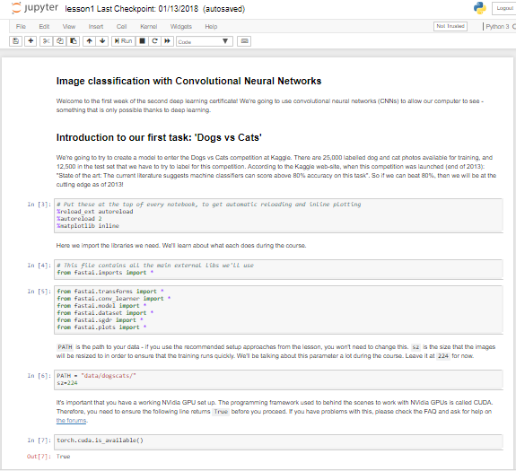
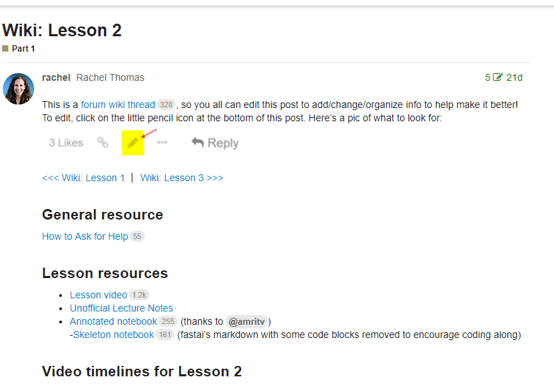
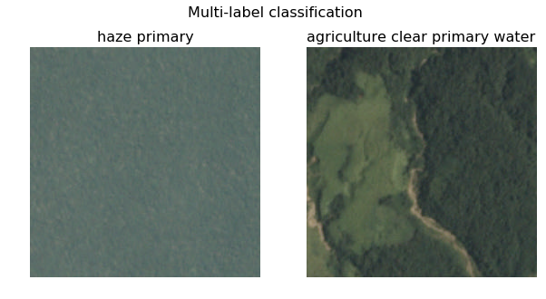
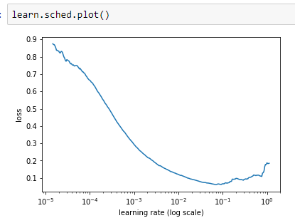
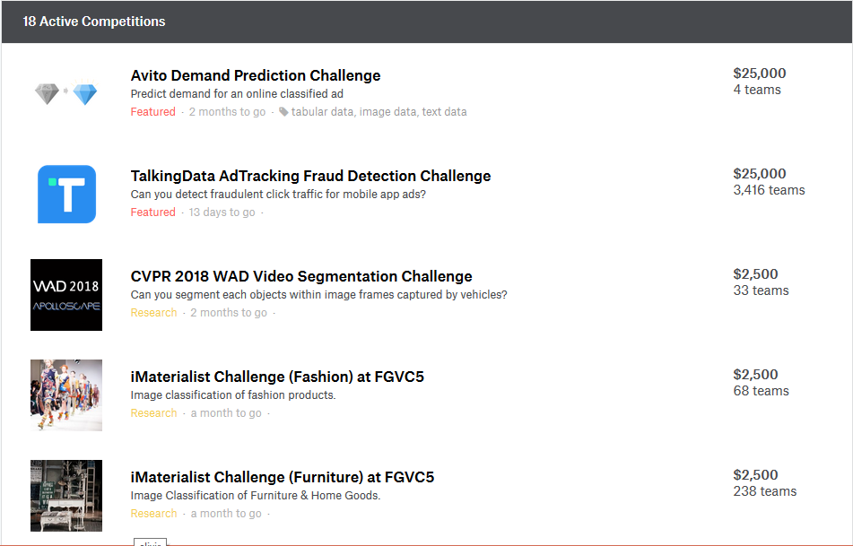
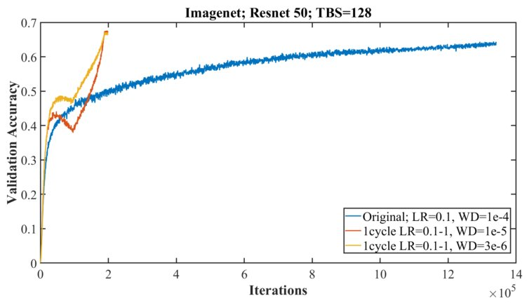
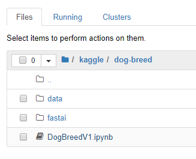

## Meetup Group
Looking for Presenters
---
# What can you learn from Fast.ai MOOC

* Quick Flyby of Concepts (~14 hrs of video)
* State of the Art Models
* Can Code --> Can Do Deep Learning
---

## Course
* U-San Francisco

Jeremy Howard and Rachel Thomas
* YouTube Videos
* Jupyter Notebooks
* Top-Down Approach
* Wiki and Forums
* PyTorch
* Need NVidia GPU - Paperspace ~ $0.40/hour
---
[Dogs vs Cats lesson1.ipynb](https://nbviewer.jupyter.org/github/fastai/fastai/blob/master/courses/dl1/lesson1.ipynb)

---
[Lesson 2 Wiki](http://forums.fast.ai/t/wiki-lesson-2/9399)

---
* Problems to Solve
* Concepts
* Resources
* Part 2 Preview
---
## Problems to Solve
* Image Classification
* Structured Data
* Language Model
* Sentiment Analysis 
* Recommendations
* Character Prediction
---
## Classification



---
## Structured Data
Rossman

Favorita

---
## Language Model
IMDB Reviews


Fine-tune from Existing Language Model

Train the Language Model to
* Predict the Next Word
* Fine-tune for Sentiment Analysis

[FitLAM Paper](https://arxiv.org/abs/1801.06146)
---
## Sentiment Analysis
Using Language Model Above

Sentiment of Movie Reviews

---
## Recommendation Engine

---
## Character Prediction
* Recurrent Neural Network
* GRU and LSTM

---
## Concepts
* Initial Success
* Validation & Test
* Differentiable Layers
* Transfer Learning
* Handling Overfitting
* Structured Data
* Architecture Design
* Kaggle Competitions
---
## Initial Success
* Four lines of Code
```python
arch=resnet34
data = ImageClassifierData.from_paths(PATH, tfms=tfms_from_model(arch, sz))
learn = ConvLearner.pretrained(arch, data, precompute=True)
learn.fit(0.01, 2)
```


---
---
## Train - Validation - Test


---
## Differentiable Layers
Stacks of differentiable non-linear functions

With Lots of Parameters

Solve Nearly any Predictive Modeling Problem
> Can we wait long enough?
---
## Transfer Learning
Replace Last Layer -> Fine-turn new layers 
[Image of Layers]

---
## Handling Overfitting
* More data
* Data Augmentation
[TODO more here]
---
## Fastai Easier to be Successful 
* Library API focused on Training a Model

** Demistifies some hyperparameter choices - weight initialization

* Integrated Tools like Learning Rate Finder
> Default values that work for the user
---
## Learning Rate Finder


---
## Structured Data
* Deep Learning for Categorical and Continuous Values
   
   Business Data
   * A few published papers
   * Used in industry
   * TWIML  #124 Jeff Dean ~24:00

---
## Denormalize Your Data

[image of big table]
---
## Handling Categorical

  Embedding for Categorical
  Date into Categorical
  Days before/after Event

```python
  cat_vars = ['Store', 'DayOfWeek', 'Year', 'Month', 'Day', 'StateHoliday', 'CompetitionMonthsOpen',
    'Promo2Weeks', 'StoreType', 'Assortment', 'PromoInterval', 'CompetitionOpenSinceYear', 'Promo2SinceYear',
    'State', 'Week', 'Events', 'Promo_fw', 'Promo_bw', 'StateHoliday_fw', 'StateHoliday_bw',
    'SchoolHoliday_fw', 'SchoolHoliday_bw']

  contin_vars = ['CompetitionDistance', 'Max_TemperatureC', 'Mean_TemperatureC', 'Min_TemperatureC',
   'Max_Humidity', 'Mean_Humidity', 'Min_Humidity', 'Max_Wind_SpeedKm_h', 
   'Mean_Wind_SpeedKm_h', 'CloudCover', 'trend', 'trend_DE',
   'AfterStateHoliday', 'BeforeStateHoliday', 'Promo', 'SchoolHoliday']
   ```
---
## Kaggle Competitions
[kaggle.com/competitions](https://www.kaggle.com/competitions)

---
## Feature Importance In Structure Data Neural Networks
(http://parrt.cs.usfca.edu/doc/rf-importance/index.html)
>To get reliable results in Python, use permutation importance

>Once model is trained, run the test set with one column randomly reordered
---
## Super-Convergence
[1cycle policy](https://arxiv.org/pdf/1803.09820)
[The 1cycle policy](https://sgugger.github.io/the-1cycle-policy.html)

https://mobile.twitter.com/jeremyphoward/status/981928159879749632/photo/1
---
## Fast and Cheap
[Stanford DAWNBench](https://dawn.cs.stanford.edu/benchmark/#cifar10-train-time)


---
## Resources
[TODO Resources]
--
## Tips
Create separate folders for your work

* Link to the Fastai project

Can git pull to always have the latest code

---
## Part 2 Preview
* Super-resolution
* Image Detection/Segmentation
* Cycle/W-GAN
* Transfer Learning of Language Models
* French English Translation

---
## Study Group
* Slack
Note: speaker notes FTW!