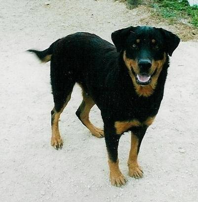

---
## Tampa.ai

Looking for Presenters

---
## Intro

smueller.tampa.ai@gmail.com

---
# What can you learn from Fast.ai MOOC

* Quick Flyby of Concepts (~34 hrs of video)
* State of the Art Models
* Can Code -> Can Do Deep Learning

---
## Course
* U-San Francisco

Jeremy Howard and Rachel Thomas
* YouTube Videos
* Jupyter Notebooks
* Top-Down Approach
* Wiki and Forums
* PyTorch
* Need NVidia GPU 

  Paperspace ~ $0.40/hour
---
[Dogs vs Cats lesson1.ipynb](https://nbviewer.jupyter.org/github/fastai/fastai/blob/master/courses/dl1/lesson1.ipynb)

---
[Lesson 2 Wiki](http://forums.fast.ai/t/wiki-lesson-2/9399)

---
[Designing great data products](https://www.oreilly.com/ideas/drivetrain-approach-data-products)

The Drivetrain Approach: A four-step process for building data products


---
* Problems to Solve
* Concepts
* Resources
* Part 2 Preview
---
## Problems to Solve
* Image Classification
* Structured Data
* Language Model
* Sentiment Analysis 
* Recommendations
* Character Prediction
---
## Classification


---
## Structured Data
Rossman

Equadorian Grocery Store (Favorita)


---
## Language Model
IMDB Reviews

* Train the Language Model to Predict the Next Word

---
## Fine-tune from Existing Language Model
* Fine-tune for Sentiment Analysis

[FitLAM Paper](https://arxiv.org/abs/1801.06146)
---
## Sentiment Analysis
Sentiment of Movie Reviews

* Better than Any Other Research
* Models how Words Relate and can Categorize the Sentiment Better
---
## Applying Sentiment Analysis
Law: Read Discovery -> Categorize document

Medical: Medical Language Model -> Fine Tune on Cancer Research
---
## Recommendation Engine

Notes: used for lots of user content, Apple News, Facebook Newsfeed
---
## Character Prediction
* Recurrent Neural Network
* GRU and LSTM

Notes: Used to teach RNN and indicate it isn't that complex
---
## Concepts
* Initial Success
* Validation & Test
* Differentiable Layers
* Transfer Learning
* Handling Overfitting
* Structured Data
* Architecture Design
* Kaggle Competitions
---
## Initial Success
* Four lines of Code
```python
arch=resnet34
data = ImageClassifierData.from_paths(PATH, tfms=tfms_from_model(arch, sz))
learn = ConvLearner.pretrained(arch, data, precompute=True)
learn.fit(0.01, 2)
```


---

## Train - Validation - Test


[Fast.ai Validation Sets](http://www.fast.ai/2017/11/13/validation-sets/)
---
Batches and Inference
* Mini-batch

* Inference/Prediction


---
## Differentiable Layers
Stacks of differentiable non-linear functions


With Lots of Parameters

Solve Nearly any Predictive Modeling Problem
> Can we wait long enough?
---
## Fast.ai API focused on User
* Demystifies some hyperparameter choices - weight initialization

* Provides good defaults for Information Provided

  Final Activation Function from output data

---
## Transfer Learning
Replace the last layer and train
Un-freeze lower layers -> Fine-turn layers with Differential Learning Rates


[original image](https://image.slidesharecdn.com/practicaldeeplearning-160329181459/95/practical-deep-learning-16-638.jpg)
---
## Handling Overfitting
* More data
* Data Augmentation
* Test Time Augmentation
* Stochastic gradient decent with restarts
* Start with smaller images
* Weight Decay (L2 Regularization)
> Dogs vs Cats -> 99.65% Accuracy 
---
## Learning Rate Finder


Order of Magnitude up from bottom 
---
## Structured Data
* Deep Learning for Categorical and Continuous Values
   
   Business Data
   * A few published papers
   * Used in industry
   * TWIML  #124 Jeff Dean ~24:00

---
## Denormalize Your Data


---
## Special Categorical
* Date
```python
add_datepart(weather, "Date", drop=False)
add_datepart(googletrend, "Date", drop=False)
```
DayOfWeek, Year, Month, Day, DayOfMonth, DayOfYear, Is_Month_End
* Days Before/after Event
```python
['StateHoliday_fw', 'StateHoliday_bw',
    'SchoolHoliday_fw', 'SchoolHoliday_bw']
```
---
## Step 1: Identifying Categorical vs Continuous

```python
  cat_vars = ['Store', 'DayOfWeek', 'Year', 'Month', 'Day', 'StateHoliday', 'CompetitionMonthsOpen',
    'Promo2Weeks', 'StoreType', 'Assortment', 'PromoInterval', 'CompetitionOpenSinceYear', 'Promo2SinceYear',
    'State', 'Week', 'Events', 'Promo_fw', 'Promo_bw', 'StateHoliday_fw', 'StateHoliday_bw',
    'SchoolHoliday_fw', 'SchoolHoliday_bw']

  contin_vars = ['CompetitionDistance', 'Max_TemperatureC', 'Mean_TemperatureC', 'Min_TemperatureC',
   'Max_Humidity', 'Mean_Humidity', 'Min_Humidity', 'Max_Wind_SpeedKm_h', 
   'Mean_Wind_SpeedKm_h', 'CloudCover', 'trend', 'trend_DE',
   'AfterStateHoliday', 'BeforeStateHoliday', 'Promo', 'SchoolHoliday']
   ```
   
   Add to Pandas Dataframe
---
## Step 2: Which rows for Validation?
```python
val_idx = np.flatnonzero(
    (df.index<=datetime.datetime(2014,9,17)) & (df.index>=datetime.datetime(2014,8,1)))
```
## Step 3: Create ModelData from data frame
```python
md = ColumnarModelData.from_data_frame(PATH, val_idx, df, yl.astype(np.float32), cat_flds=cat_vars, bs=128,
                                       test_df=df_test)
```
---
## Step 4: Create a list size of Embedding Matrix
```python
emb_szs = [(c, min(50, (c+1)//2)) for _,c in cat_sz]
```

---
## Step 5: Get Learner
```python
m = md.get_learner(emb_szs, len(df.columns)-len(cat_vars),
                   0.04, 1, [1000,500], [0.001,0.01], y_range=y_range)
```

## Step 6: Call fit
```python
m.fit(lr, 3, metrics=[exp_rmspe])
```
> Before Fast.ai, had to create all of this logic by hand each time

---
## Kaggle Competitions
[kaggle.com/competitions](https://www.kaggle.com/competitions)

---
## Feature Importance In Structure Data Networks
(http://parrt.cs.usfca.edu/doc/rf-importance/index.html)
>To get reliable results in Python, use permutation importance

>Once model is trained, run the validation set with one column randomly reordered
---
## Do we really need all of these columns?

* Method to reorder a column
* Retains the distribution
> Impact of Loss represents importance
---
## Resources
[Student Notes on Fast.ai Part 1](https://github.com/reshamas/fastai_deeplearn_part1)

[Fast AI/Pytorch in Production](http://forums.fast.ai/t/using-a-fast-ai-model-in-production/12033/6)

[Fast.ai Machine Learning Discussion](http://forums.fast.ai/t/another-treat-early-access-to-intro-to-machine-learning-videos/6826)

[An Introduction to Deep Learning for Tabular Data](http://www.fast.ai/2018/04/29/categorical-embeddings/)
---
## Tips
Create separate folders for your work

* Link to the Fastai project

Can git pull to always have the latest code

---
## Super-Convergence
[Leslie Smith's 1cycle Policy Paper](https://arxiv.org/pdf/1803.09820)

[Fast.ai Implementation](https://sgugger.github.io/the-1cycle-policy.html)


[image source](https://mobile.twitter.com/jeremyphoward/status/981928159879749632/photo/1)
---
## Fast and Cheap
[Stanford DAWNBench](https://dawn.cs.stanford.edu/benchmark/#cifar10-train-time)

---

---
## Part 2 Preview


Super-resolution
---
## Image Detection/Segmentation


---
## Style Transfer via CycleGAN/W-GAN

---
## Transfer Learning of Language Models

* Start with Wikipedia-derived Language Model
* Fine tune on IMDB
* Sentiment Analysis 
---
## French English Translation


---
## Study Group
* Slack
* Show and Tell Meetings
---
## Show and Tell on Challenges
* Pick an old Kaggle Competition
* Short presentations of solutions


Note: speaker notes FTW!